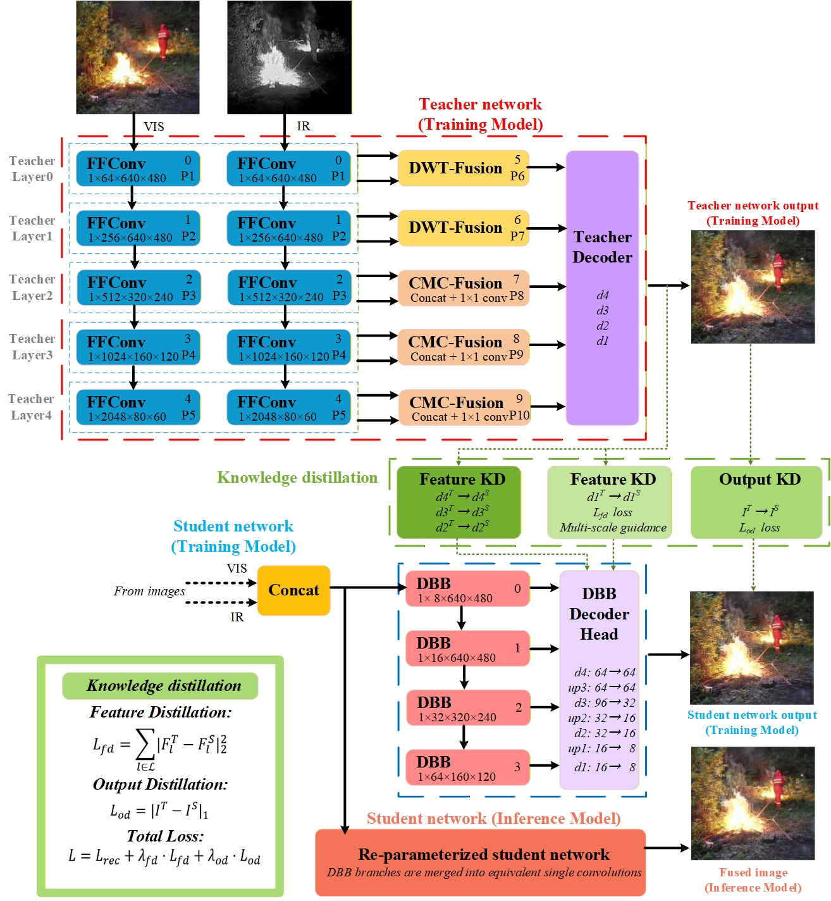

# FF-Fusion Open-Source Documentation Bundle

This folder is a GitHub-ready documentation bundle for the FF-Fusion project. It was prepared as a standalone subfolder so the original workspace structure can remain unchanged.

## Project Overview

FF-Fusion is a scenario-oriented visible-infrared image fusion framework for forest fire monitoring under resource-constrained deployment settings. The project combines:

- a high-capacity teacher network for fusion learning,
- a compact student network for practical inference,
- feature-level knowledge distillation,
- structural re-parameterization for deployment, and
- edge-device benchmarking on a D-Robotics RDK X5 platform.

## Verified Project Facts

- Dataset name: `TF-1770 (Forest Fire Fusion-1770)`
- Dataset scale: `1,770` synchronized visible-infrared image pairs
- Acquisition viewpoints: firefighter first-person view and UAV aerial view
- Pair preprocessing: pixel-level ECC registration, overlap-region crop, unified resize to `640 x 480`
- Deployable student checkpoint in the workspace: about `1.34 MB` FP32 (`VIF_student_95.pth`)
- Edge benchmark source: `result/benchmark_results(1).json`
- Verified edge benchmark numbers on `1770` image pairs:
  - inference-only latency: `14.19 ms`
  - end-to-end latency: `36.97 ms`
  - end-to-end throughput: `27.05 FPS`

## What This Documentation Covers

- [Project structure](PROJECT_STRUCTURE.md)
- [Dataset and annotation notes](DATASET.md)
- [Result summary](RESULTS.md)
- [Reproducibility notes](REPRODUCIBILITY.md)
- [Public-release checklist](RELEASE_CHECKLIST.md)
- [Bundled source code](source-code/README.md)

## Main Workspace Components

The current workspace contains these main components:

- Training code: `code/code`
- Deployment-oriented code: `code/部署用，精简版本/code-V_deplpy`
- Quantitative results: `result/定量指标统计(1).xlsx`
- Deployment benchmark log: `result/benchmark_results(1).json`
- Manuscript source: `FF-Fusion A Teacher-Student Distillation Framework for Lightweight Visible-Infrared Image Fusion in Forest Fire Scenarios-20260228.docx`

This documentation bundle also includes a cleaned source-code snapshot for upload:

- `source-code/training`
- `source-code/deployment`

## Quick Start for Public Release

1. Publish the project code and keep the training and deployment folders clearly separated.
2. Add a license before making the repository public.
3. Replace hardcoded dataset paths in the training scripts.
4. Add a requirements file or environment specification.
5. Decide which model weights and sample images can be legally redistributed.
6. Publish the dataset link when the Zenodo record is ready.

## Important Release Caveats

- The current fusion training scripts still contain hardcoded local dataset paths.
- The current released fusion scripts read the full dataset directory and do not yet expose an explicit train-validation-test split for fusion.
- If the public repository reports an INT8 deployment artifact size, the corresponding compiled artifact should also be released or the size claim should be omitted.
- If downstream detection or segmentation experiments are released, the corresponding annotation files and split lists should be published together.

## Suggested Repository Description

`FF-Fusion: A teacher-student visible-infrared image fusion framework for lightweight forest fire perception and edge deployment.`
